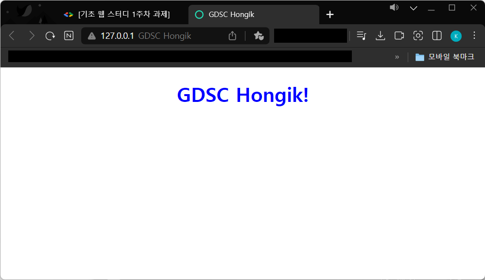

# WIL1

## HTML
```HTML(하이퍼텍스트 마크업 언어)```은 웹 페이지를 만들기 위해 사용되는 언어로, 문서의 구조와 콘텐츠를 정의하는데 사용됩니다.

### 기본 구조
- ```<!DOCTYPE>```: 현재 문서가 HTML 문서 타입을 명시합니다. HTML5 문서 타입은 ```<!DOCTYPE html>```입니다.
- ```<html>```: HTML 문서의 루트 요소를 정의합니다.
- ```<head>```: HTML 문서의 메타데이터를 정의합니다. 여기에는 문서 제목(```<title>```), 문자 인코딩(```<meta>```), 외부 스타일시트(```<link>```), 스크립트(```<script>```) 등이 포함됩니다.
- ```<body>```: HTML 문서의 본문을 정의합니다. 여기에는 텍스트, 이미지, 링크, 표, 목록 등이 들어갑니다.

### 기본 태그 예시
- ```<h1>```부터 ```<h6>```: 제목을 나타내는 태그입니다. 숫자가 작을수록 큰 제목입니다.
- ```<p>```: 문단을 나타내는 태그입니다.
- ```<br>```: 줄바꿈을 나타내는 태그입니다.
- ```<b>```: 굵은 텍스트를 나타내는 태그입니다.
- ```<i>```: 기울임꼴 텍스트를 나타내는 태그입니다.
- ```<a>```: 하이퍼링크를 생성하는 태그입니다. ```href``` 속성으로 링크 주소를 지정합니다.
- ``````: 이미지를 삽입하는 태그입니다. ```src``` 속성으로 이미지 파일 경로를 지정하고, ```alt``` 속성으로 대체 텍스트를 설정합니다.

## CSS
```CSS(Cascading Style Sheet)```는 웹 페이지를 스타일링하고 레이아웃을 지정하는 언어입니다.

### 스타일 변경
텍스트의 글꼴, 색상, 크기, 간격 등을 변경할 수 있습니다.
- ```font-size```글꼴의 크기를 지정합니다. 주요 단위로는 px, em, rem이 있습니다. 
- ```color``` 텍스트의 색상을 지정합니다.
- ```text-align``` 텍스트를 정렬합니다. left, right, center, justify 값이 올 수 있습니다.
- ```font-family``` 텍스트의 글꼴을 지정합니다.

### 레이아웃 조정
여러 개의 열로 분할하거나, 특정 요소를 배치할 수 있습니다.
- 인라인, 블랙레밸
- 박스모델
- 포지션

### 애니메이션 및 장식 효과 추가
움직이는 요소, 페이드 인/아웃 효과, 그림자 등을 적용할 수 있습니다.

## 과제
