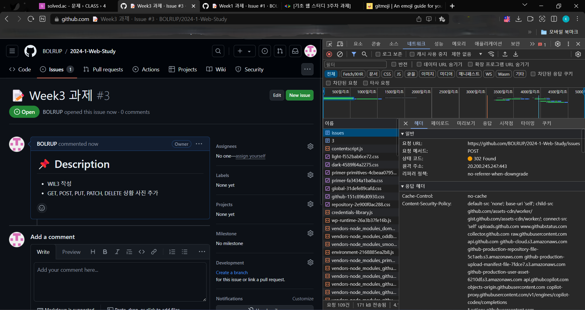

# WIL3
## GET
HTTP ```GET``` 메서드는 특정한 리소스를 가져오도록 요청합니다. ```GET``` 요청은 데이터를 가져올 때만 사용해야 합니다.


## POST
HTTP ```POST``` 메서드는 서버로 데이터를 전송합니다. 요청 본문의 유형은 ```Content-Type``` 헤더로 나타냅니다.

```PUT```과 ```POST```의 차이는 [멱등성](https://developer.mozilla.org/ko/docs/Glossary/Idempotent)으로, ```PUT```은 멱등성을 가집니다. ```PUT```은 한 번을 보내도, 여러 번을 연속으로 보내도 같은 효과를 보입니다. 즉, 부수 효과(side effect)가 없습니다.



## PUT
HTTP ```PUT``` 메서드는 요청 페이로드를 사용해 새로운 리소스를 생성하거나, 대상 리소스를 나타내는 데이터를 대체합니다.

```PUT```과 ```POST```의 차이는 [멱등성](https://developer.mozilla.org/ko/docs/Glossary/Idempotent)으로, ```PUT```은 멱등성을 가집니다. ```PUT```은 한 번을 보내도, 여러 번을 연속으로 보내도 같은 효과를 보입니다. 즉, 부수 효과가 없습니다.


## PATCH
HTTP ```PATCH``` 메소드는 리소스의 부분적인 수정을 할 때에 사용됩니다.

HTTP ```PUT``` 메소드는 문서 전체의 완전한 교체만을 허용합니다. 반면 ```PATCH``` 메소드는 ```PUT``` 메소드와 달리 멱등성을 가지지 않는데, 이는 동일한 patch 요청이 다른 결과를 야기할 수도 있음을 뜻합니다. 하지만 ```PATCH```를 ```PUT```과 같은 방식으로 사용함으로써 멱등성을 가지게 할 수도 있습니다.

```PATCH``` (혹은 ```PUT```)는 다른 리소스에게 부수효과(side-effects)를 일으킬 가능성이 있습니다.


## DELETE
HTTP ```DELETE``` 메서드는 지정한 리소스를 삭제합니다.


## HTTP/1.1
### 역사
- <b>출시 연도</b>: 1997년 (RFC 2068, 이후 1999년 RFC 2616으로 표준화)
- <b>주요 목적</b>: HTTP/1.0의 한계 극복과 성능 향상

### 주요 특징
- <b>지속 연결 (Persistent Connections)</b>: 기본적으로 연결을 유지하여 여러 요청을 한 연결에서 처리함으로써 TCP 연결 설정/해제에 따른 오버헤드를 줄임.
- <b>파이프라이닝 (Pipelining)</b>: 하나의 연결에서 여러 요청을 병렬로 보낼 수 있으나, 응답 순서 문제가 있어 널리 사용되지 않음.
- <b>캐싱 메커니즘</b>: 향상된 캐시 제어 헤더 도입으로 클라이언트와 서버 간의 효율적인 데이터 전송 가능.
- <b>가변 길이 메시지 (Chunked Transfer Encoding)</b>: 메시지의 길이를 미리 알 수 없을 때 데이터가 전송되는 방식을 지원.
- <b>호스트 헤더</b>: 하나의 IP 주소에서 여러 도메인을 운영할 수 있게 함.

## HTTP/2
### 역사
- <b>출시 연도</b>: 2015년 (RFC 7540)
- <b>주요 목적</b>: 성능 최적화, 특히 지연 시간 감소 및 병목 현상 해소

### 주요 특징
- <b>이진 프레이밍 (Binary Framing)</b>: 텍스트 기반에서 이진 형식으로 변경되어 데이터 직렬화/역직렬화 과정이 간소화되고 성능이 향상됨.
- <b>멀티플렉싱 (Multiplexing)</b>: 한 연결에서 여러 스트림을 동시에 처리하여 응답 순서가 문제되지 않음.
- <b>헤더 압축 (HPACK)</b>: 헤더 데이터를 압축하여 전송량을 줄임.
- <B>서버 푸시 (Server Push)</b>: 클라이언트 요청 없이도 서버가 리소스를 클라이언트에 전송할 수 있음.
- <b>우선순위 (Priority)</b>: 리소스의 중요도에 따라 우선순위를 지정하여 효율적으로 자원을 사용할 수 있음.

## HTTP/3
### 역사
- <b>출시 연도</b>: 2022년 (RFC 9114로 표준화)
- <b>주요 목적</b>: 지연 시간 감소와 연결 복원력 강화

### 주요 특징
- <b>QUIC 프로토콜 기반</b>: 기존 TCP 대신 UDP 기반의 QUIC 프로토콜 사용으로 더 빠른 연결 설정 및 지연 시간 감소.
- <b>스트림 제어</b>: 각 스트림이 독립적으로 관리되어 하나의 스트림에서 문제가 발생해도 다른 스트림에 영향을 미치지 않음.
- <b>TLS 1.3 통합</b>: 보안 기능이 프로토콜에 내장되어 초기 연결 설정 시 보안 협상 과정이 간소화됨.
- <b>향상된 연결 복원력</b>: 네트워크 환경이 변하더라도 연결이 쉽게 복원되어 모바일 환경에서 유리함.